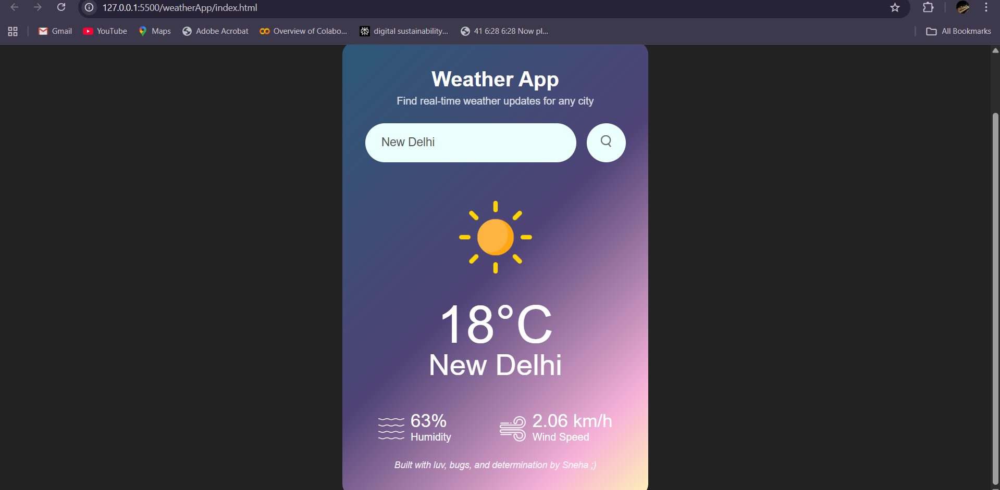
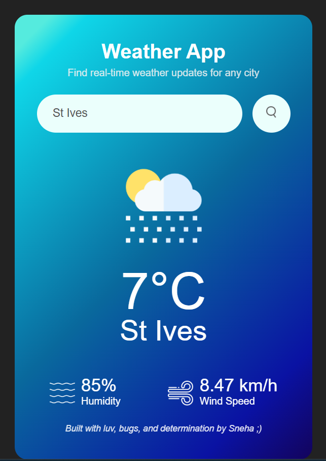
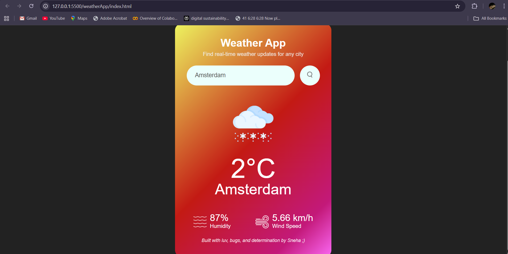
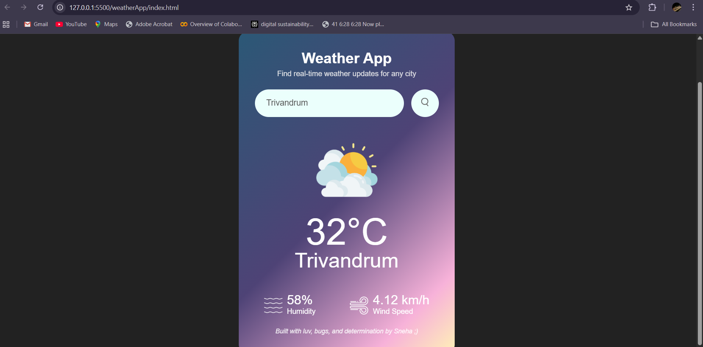
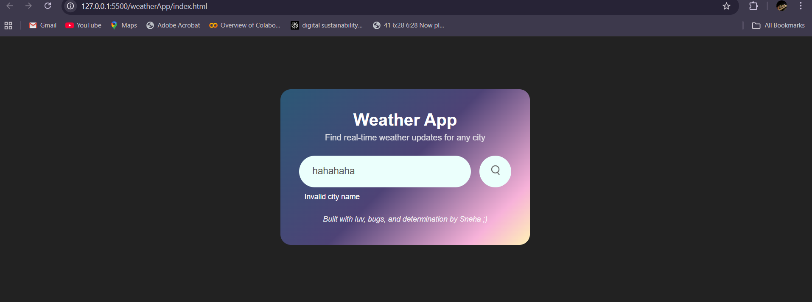

# 🌦️ Weather App

A simple and elegant weather application that allows users to check real-time weather conditions for any city in the world.  
Built using **HTML, CSS, and JavaScript**, with live data fetched from the **OpenWeather API**.

##  Features

-  Search weather by city name  
-  Displays temperature, humidity & wind speed  
-  Clean and modern UI   
- Instant results with real-time API data  
- Error handling for invalid city names  

## Tech Stack

- HTML
- CSS
- JAVASCRIPT
- OpenWeatherMap API

## 📸 Screenshots

### Clear Weather

### Rainy Weather

### Snowy Weather

### Cloudy Weather

### Invalid City Input

## How to Run Locally

1. Clone the repository

- https://github.com/snehaelzadavid06/Weather-App.git

2. Navigate into the project

- cd Weather-App

3. Open index.html in your browser

- Double click it
        OR
- Use Live Server in VS Code

